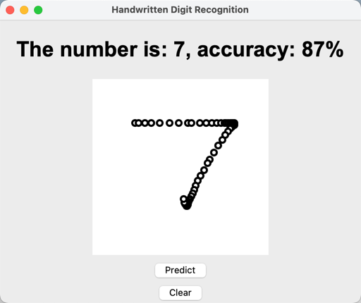

# Project Introduction
- This is a project is a hand write number prediction project. 
- It is based on the MNIST dataset. 
- The project is based on the keras framework. 
- The project is based on the python language.

You could use the following command to run the project.
```python3 main.py```

You could choose the different function of this project by changing the main.py file.

1. check your system's information to see if it is suitable for this project.
2. train the model
3. run the gui  to predict the number



# Collaborator
Robin Lan

# Time
2023/03

# And...
**Please let me know if you have any questions and leave a comment if you like it. 
Thank you.**